Christchurch is my favorite place in the world. It’s where I’ve spent most of my life. There's so much to do, the people are great, the surroundings are beautiful, and the weather is fresh!

When I moved to Auckland to pursue my career at Fisher & Paykel Healthcare, I felt homesick and wanted to create something as a tribute to my home city. I decided to learn how to use a laser cutter and build a wooden map of Christchurch.

I wanted the map to be 3D, with distinct sea, land, and street layers – encapsulating a million-year-long timeline.

## Setting Up

First, I developed the different layers of the map. I used a website called SnazzyMaps to create a simple land-only map of Christchurch and a streets-only map.

| | | |
|--|--|--|
| 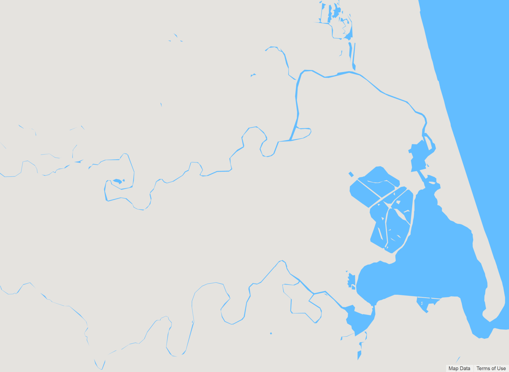 | 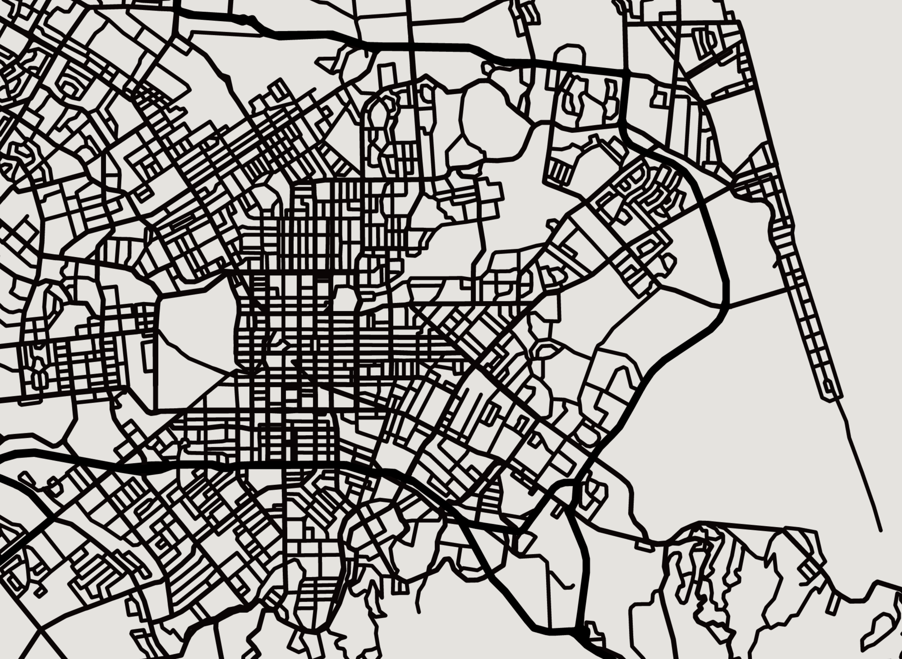 | 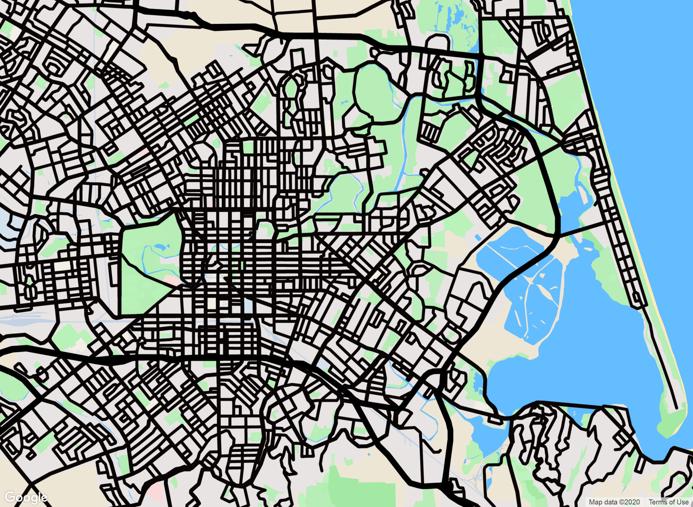 |

The images above show the different layers I extracted from SnazzyMaps, which I then processed using Inkscape to convert into vectors.

Then, I imported the DXF vector files into the laser-cutting software and edited a few nodes to ensure the wood was cut as expected.

## Laser-Cutting

Initially, I bought some plywood from a local hardware store, but after setting it up in the laser cutter, the wood started burning—this was likely due to the poor glue used between the layers that caught fire.

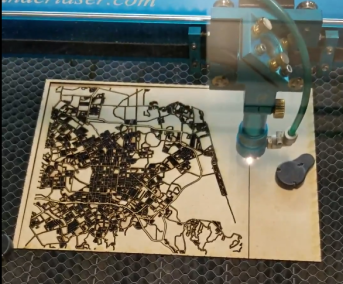

Learning from this, I bought better-quality plywood and restarted the cutting of the different layers. There's a backboard layer (representing the water), a land layer, and finally the streets.

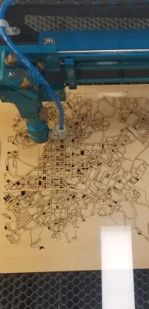

This time, the cutting was much cleaner with minimal charring!

## Putting it all together

I first glued the land layer to the backboard and poured blue epoxy to create the sea.

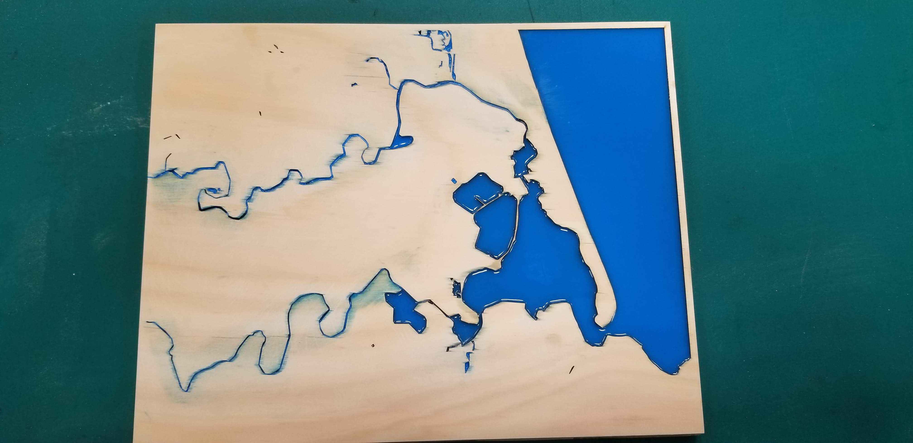

Then, I glued the street layer.

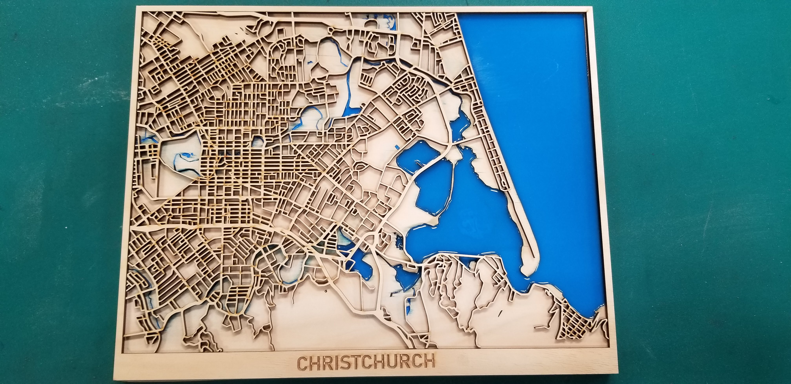

## Final Product

| | | |
|--|--|--|
| 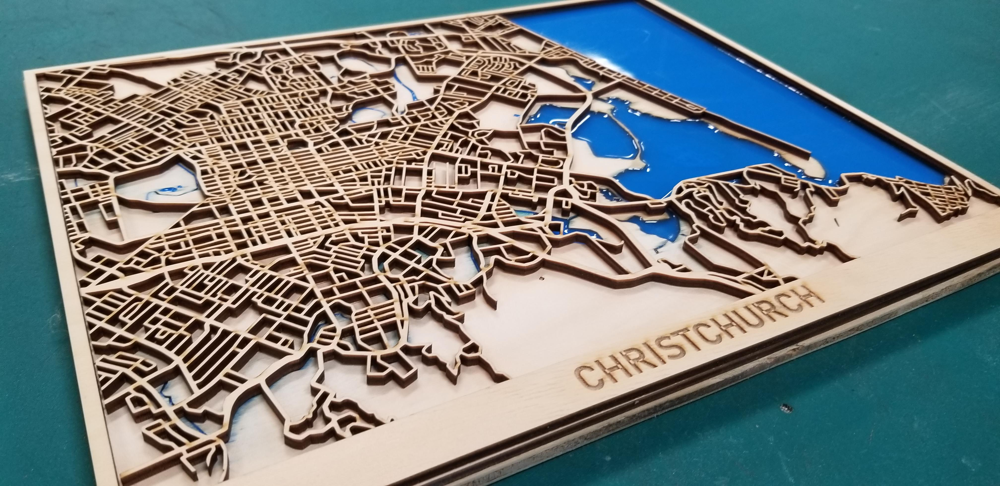 | 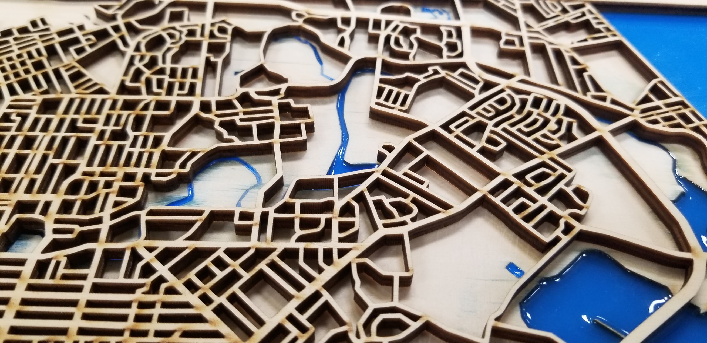 | 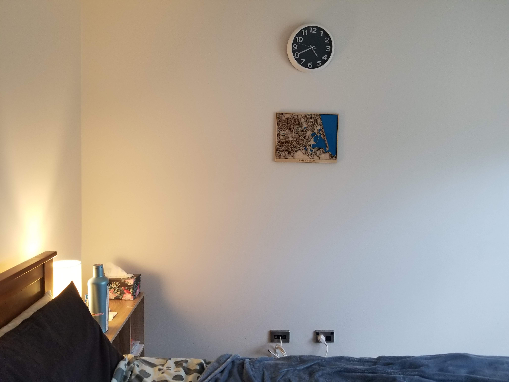 |

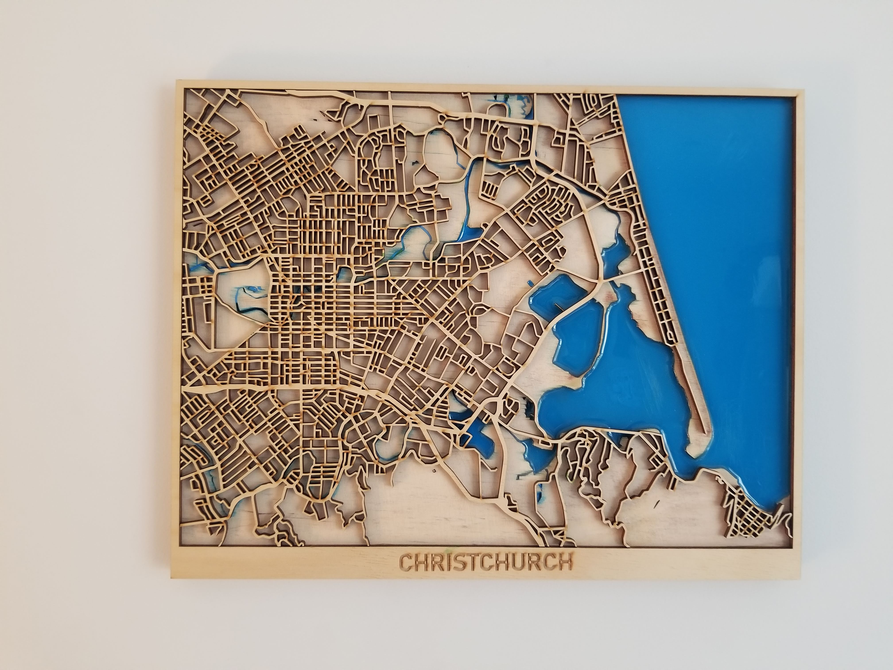

