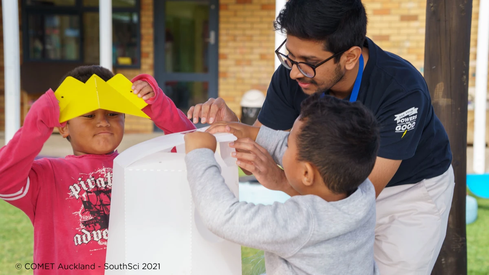

SouthSci is a New Zealand government program that connects schools in low socio-economic areas of South Auckland with science, providing both funding and expertise for community research projects. The goal is to demonstrate the value of science, showcase career paths in the science sector, and foster relationships between science organizations, researchers, and students.

**Where do I come in?** I was one of the volunteer experts who collaborated with students and teachers to bring science alive in their classrooms.

## Mission

We worked with our assigned teacher to devise a science-based project that would excite the students. Since our audience was preschoolers (2–5 years old), the project needed to be safe and simple.

After some research, we discovered a lack of awareness about rubbish management in the community. Consequently, we decided to address this issue by creating visually appealing rubbish bins, tackling both scientific engagement and waste education.

Following several design workshops with the students, we settled on building rocket-shaped rubbish bins!

## How did we do this?

We designed a flatpack version of the rubbish bins using SolidWorks and utilized a laser cutter to shape them from polypropylene sheets.

Considering the students' age, we prioritized safety and ease of assembly. Thus, we opted for a soft plastic like polypropylene and used screws instead of glue for assembly. We then took the flat packs to the school and worked with the students to put them together.

| | | |
|--|--|--|
|  |  |  |

And it was a success—they loved it!

In follow-up emails, we learned that the bins are holding up well, the students are using them, and parents have started incorporating similar ideas at home.

## Why I did this

I am an advocate for learning and education in society. I believe education has the power to solve many of the world’s social problems, uplift entire communities from poverty, and brighten someone’s day a little bit. Incorporating the idea of ‘anyone can do science’ from an early age increases diversity in STEM jobs—which is beneficial for everyone!

This project allowed me to give back to the community that has given me so much and inspire the next generation with the knowledge I've gained. Seeing a kid excited is the best feeling in the world!

This project also taught me how to break down complex engineering processes into simple ideas that anyone can digest.
