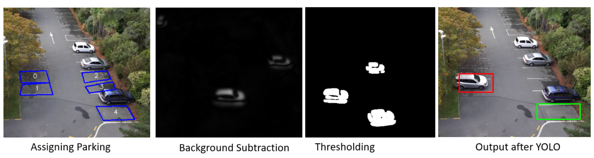

> [Read the Final Published Paper](assets/carpark_paper.pdf)

## The Problem

- Prolonged parking overstays result in revenue loss for the parking company.
- The current manual method of detecting parking occupancy is inefficient and requires parking officers.

## Solution

Implement a high-mounted camera system with computer vision algorithms and deep learning to validate parking spot occupancy.

### Key Steps:

1. Grey Scaling and Gaussian Blur
2. Background Subtraction
3. Thresholding
4. Dilation
5. Non-Zero Pixels
6. YOLO Neural Network

## Results

| Methods                                                          | Accuracy | Explanation                                                                                      |
|------------------------------------------------------------------|----------|--------------------------------------------------------------------------------------------------|
| Background Subtraction Only                                      | 50%      | Detected every small movement                                                                    |
| Background Subtraction + Thresholding                            | 72%      | Filtered out small movements                                                                     |
| Background Subtraction + Gaussian Blur + Thresholding + Dilation | 84%      | Reduced noise from the image; still detected humans and other non-vehicle related movements      |
| Addition of YOLO Neural Network                                  | 91%      | Eliminated non-vehicle related movement                                                         |

The final achieved accuracy was 91%, surpassing previous research on this application [1](https://ieeexplore.ieee.org/document/8221062).

## Future Work

- Further train YOLO to improve accuracy in classifying detected movements.
- Implement multiple cameras to capture images from different angles, preventing small cars from being hidden by larger neighboring cars.
- Develop a web app for parking companies to automate monitoring of their parking spots.
